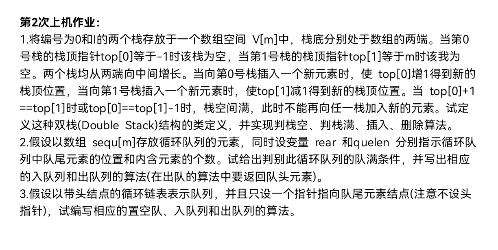

1. 双栈结构体定义，
	+ 属性有：
		1. 栈顶指针 * 2
		2. 数组长度
	+ 要实现的方法有：
		1. 栈空栈满判断
		2. 插入
		3. 删除
```cpp
#include <iostream>

class DoubleStack {
private:
    int* arr;    // 存储栈元素的数组
    int top[2];  // 两个栈顶指针
    int size;    // 数组的长度

public:
    DoubleStack(int size) : size(size) {
        arr = new int[size];
        top[0] = -1;
        top[1] = size;
    }

    // 析构函数 释放内存 防止内存泄漏 
    ~DoubleStack() {
        delete[] arr;
    }


    bool isFull() {
        return top[0] + 1 == top[1];
    }

    bool isEmpty(int stackId) {
        if (stackId == 0)
            return top[0] == -1;
        else
            return top[1] == size;
    }

    void push(int stackId, int value) {
        if (isFull())
            throw std::overflow_error("Stack is full");
        if (stackId == 0)
            arr[++top[0]] = value;
        else
            arr[--top[1]] = value;
    }

    int pop(int stackId) {
        if (isEmpty(stackId))
            throw std::underflow_error("Stack is empty");
        if (stackId == 0)
            return arr[top[0]--];
        else
            return arr[top[1]++];
    }
};

int main() {
    DoubleStack ds(5); // 创建一个大小为5的双栈
    
    // 对第一个栈进行操作
    // 检查栈空栈满状态
    std::cout << "Is stack 0 empty? " << (ds.isEmpty(0) ? "Yes" : "No") << std::endl; // 应该输出 Yes
    ds.push(0, 1);
    ds.push(0, 2);
    ds.push(0, 3);
    std::cout << "Pop from stack 0: " << ds.pop(0) << std::endl; // 应该输出 3

    // 对第二个栈进行操作
    std::cout << "Is stack 1 empty? " << (ds.isEmpty(1) ? "Yes" : "No") << std::endl; // 应该输出 Yes
    ds.push(1, 10);
    ds.push(1, 20);
    ds.push(1, 30);

    std::cout << "Is stack full? " << (ds.isFull() ? "Yes" : "No") << std::endl; // 应该输出 Yes
    std::cout << "Pop from stack 1: " << ds.pop(1) << std::endl; // 应该输出 30
    std::cout << "Is stack full? " << (ds.isFull() ? "Yes" : "No") << std::endl; // 应该输出 No

    return 0;
}
```
1. 循环队列结构体定义
	> 借助数组实现
	+ 属性
		1. 队尾指针
		2. 队列长度 quelen
		3. 数组长度 m
	+ 方法
		1. 队满判读
		2. 入队
		3. 出队

![[circular_queue.png]]
1. 队列结构体定义
	> 由带头节点的循环链表实现
	+ 属性
		1. 队尾指针
	+ 方法
		1. 置空
		2. 入队
		3. 出队