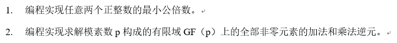

# 作业 1



```python
def gcd(a, b):
    """计算 a 和 b 的最大公约数"""
    while b != 0:
        a, b = b, a % b
    return a

def lcm(a, b):
    """计算 a 和 b 的最小公倍数"""
    return a * b // gcd(a, b)

if __name__ == "__main__":
    num1 = 18
    num2 = 15
    print(f"{num1} 和 {num2} 的最大公约数是 {gcd(num1, num2)}, 最小公倍数是 {lcm(num1, num2)}")
```
输出：
![[../images/output_1.png]]
